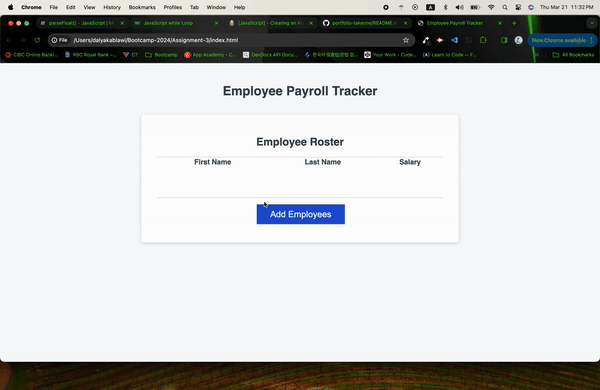

# Assignment 03

# JavaScript: 

## Description

The goal of this assignment was to update the source code with functions to render the required information on the page and in the console as instructed.

I did this by:

- Completing the collectEmployees function by adding a while loop that adds data that the user is prompted to enter to the empty totalEmployees array.
- Added an object to store the user data, and pushed the contents into the array.
- Console logging the array and returning the array to render on the page in the form of a table 
- Completing the displayAverageSalary function by adding the salary values and dividing them by the length of the array and logging the results to the console.
- Completing the getRandomEmployee function by adding a Math.random function to generate a random employee and logging the result to the console. 

## User Story

```md
AS A payroll manager
I WANT AN employee payroll tracker
SO THAT I can see my employees' payroll data and properly budget for the company
```

## Acceptance Criteria

```md
GIVEN an employee payroll tracker
WHEN I click the "Add employee" button
THEN I am presented with a series of prompts asking for first name, last name, and salary
WHEN I finish adding an employee
THEN I am prompted to continue or cancel
WHEN I choose to continue
THEN I am prompted to add a new employee
WHEN I choose to cancel
THEN my employee data is displayed on the page sorted alphabetically by last name, and the console shows computed and aggregated data
```

## Screenshots



## URLs

[GitHub repository URL](https://github.com/DalyaKablawi/update-payroll-data)

[Deployed application URL](https://dalyakablawi.github.io/update-payroll-data/)